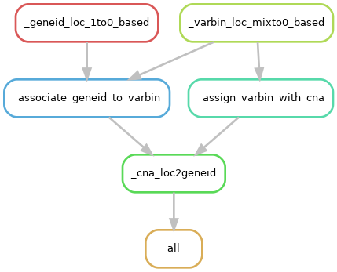

# Goal

Convert the single-cell CNA profile based on the genomic bins locations to the
one based on genes (here gene IDs).

This is a downstream util for the Navin lab's in-house pipeline `CNA_pipeline
v1.3` which uses hg19 (GRCh37).



# Inputs

1> CNA file across single cells generated by the `CNA_pipeline v1.3`.

For example:

```
chrom   chrompos    abspos  C1_S1_L001
1   977836  977836  0.726334447999411
1   1200863 1200863 0.726334447999411
1   1455238 1455238 0.726334447999411
2   0   249250621   1.60793145836484
2   237131  249487752   1.60793145836484
2   454245  249704866   1.60793145836484
```

Chrom 23 = X and 24 = Y.

2> Genomic locations of Varbin generated by the `CNA_pipeline v.1.3`.

This is a strange coordination with a mixed scheme. For example:

```
bin.chrom   bin.start   bin.end bin.length  gene.count  cgi.count   dist.telomere   gc.content
chr1    0   977835  977836  23  30  919083  0.45760009212891
chr1    977836  1200862 223027  11  41  1146783 0.611899007743492
chr1    1200863 1455237 254375  18  33  1371964 0.592286977886868
chr1    1455238 1758056 302819  11  35  1699329 0.545698915854107
```

Chrom is named as chr1, chr2, ..., chr22, chrX, chrY.

3> Genomic locations for genes (gene_id) downloaded from Ensembl BioMart
(Ensembl-75 for the latest hg19). These columns are selected: Chromosome Name,
Gene Start (bp), Gene End (bp), Ensembl, Gene ID, Associated Gene Name, Strand.

For example:

```
Chromosome Name Gene Start (bp) Gene End (bp)   Ensembl Gene ID Associated Gene Name    Strand
1   50902700    50902978    ENSG00000271782 RP5-850O15.4    -1
1   103817769   103828355   ENSG00000232753 RP11-347K2.1    1
1   50927141    50936822    ENSG00000225767 RP5-850O15.3    1
```
# Dependencies

Snakemake, bedops, Python-3

# How to run

0. Examine the inputs format.
   1. Does CNA file have at least three columns with header: `chrom   chrompos
      abspos  C1_S1_L001`, for example. The possible names chromosome 23 and 24
      would be changed to X and Y internally by this Snakemake.
   2. Does the varbin reference have at least 3 columns with header: `bin.chrom
      bin.start   bin.end`. And is the coordination in a mixed style: [0, 0]?
   3. Does the Ensembl follows the format as described before?
1. Prepare a `run.config` file to save all the required inputs. The template of
   the config is available at the <kbd>example</kbd> folder.
2. Run this command `snakemake -s Snakefile.snakefile --configfile run.config
   all` at terminal.

# Known problems

Only human genome is supported because internally the Snakemake file explicitly
changes the chromosome 23 and 24 to X and Y, respectively.

There are genes overlapping more than one VarBins. In this case, these genes are excluded. Only those genes (gene_id) with one VarBin overlapped are taken.

